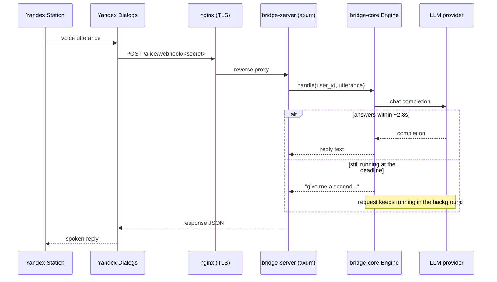

# alice-llm-bridge

A private Yandex Alice skill that turns a Yandex Station into a voice
interface for large language models. Family members are recognized by name,
each with their own conversation history, persona and safety rules; context
depth and model choice are tunable by voice to keep API spend predictable.
Backend written in Rust.

## Features

- **Multi-provider** — talks to any OpenAI-compatible chat completions API
  (DeepSeek, OpenRouter, OpenAI, a local Ollama instance) through one client;
  switching providers is a config change, not a code change.
- **Family profiles** — each member has a name, spoken aliases, an optional
  birthday, a persona and a role. Children get a safety block appended to
  the system prompt automatically.
- **Cost-aware context** — a sliding window of recent turns, adjustable by
  voice, with older history folded into a rolling summary by a cheap model
  instead of being dropped or sent in full every time.
- **Fast/smart model routing** — a cheap model answers by default; "think
  hard about this" or "switch to the smart model" upgrades a single request
  or the whole session.
- **Usage accounting** — every exchange is logged with token counts and
  computed cost; "how much have we spent" answers from Postgres.
- **Deferred answers** — works around the Alice webhook's ~4.5 second
  deadline: if the model is still thinking when the deadline hits, the skill
  says so and delivers the answer on the next utterance.
- **Private by construction** — the skill stays in draft status in the
  Yandex Dialogs console (never published), the webhook path includes a
  secret segment, and an account allowlist rejects anyone else.

## How it works



If the deadline is missed, the next utterance — literally anything, "ну
что?" works — is checked against the pending answer store first; a finished
completion is returned immediately, otherwise the skill asks for a bit more
time.

## Architecture

A Cargo workspace of four crates, each with a single responsibility:

| Crate | Responsibility |
|---|---|
| `alice-protocol` | Typed request/response models for the Yandex Dialogs webhook protocol. Serde only, no logic. |
| `llm-providers` | The `ChatProvider` trait and an `OpenAiCompatClient` implementing it for any OpenAI-compatible endpoint. |
| `bridge-core` | The domain: profiles, voice command parsing, prompt assembly, sliding context, deferred answers, cost accounting. Depends only on the `ChatProvider` trait and its own `ConversationStore` trait — no HTTP, no database. |
| `bridge-server` | axum webhook, TOML configuration, the Postgres implementation of `ConversationStore`, process wiring. |

`bridge-core` is the part worth reading first: it has no knowledge of Alice,
HTTP, or Postgres, which is what makes it possible to unit-test the entire
dialogue engine — including the deferred-answer race — without a network or
a database.

## Voice commands

| Say | Effect |
|---|---|
| «это Маша» / «я Маша» | Switch the active profile to Маша |
| «кто я» | State the active profile |
| «забудь всё» / «начни сначала» | Clear the active profile's history and summary |
| «помни последние 5 реплик» | Set the context window (1–50) |
| «переключись на умную модель» | Use the smart model preset until changed back |
| «смени модель на быструю» | Use the fast model preset |
| «подумай как следует, <вопрос>» | Answer this one question with the smart model |
| «расскажи сказку» (or any configured mode trigger) | Enter a themed mode |
| «выйди из режима» | Return to the default mode |
| «сколько потратили» | Report today's and this month's usage |
| «помощь» | List what the skill can do |
| anything else | Sent to the model as a question |

## Configuration

Copy `config.example.toml` to `config.toml` and adjust:

- `[server]` — listen address and `allowed_user_ids` (Yandex account IDs
  permitted to use the skill; leave empty only for local testing).
- `[defaults]` — default profile, context window size, reply budget,
  provider timeout, UTC offset for daily/monthly usage reports.
- `[providers.<name>]` — `base_url` and the environment variable holding
  the API key for each OpenAI-compatible provider.
- `[models.fast]` / `[models.smart]` — which provider and model back each
  preset, token limits and per-million-token prices for cost accounting.
- `[[profiles]]` — one entry per family member: name, spoken aliases,
  optional birthday, `role` (`adult` or `child`), persona text.
- `[[modes]]` — optional themed conversation presets with trigger phrases.

| Environment variable | Purpose |
|---|---|
| `CONFIG_PATH` | Path to the TOML config (default `config.toml`) |
| `WEBHOOK_SECRET` | Secret path segment the webhook URL must include |
| `DATABASE_URL` | Postgres connection string |
| `DEEPSEEK_API_KEY` (or whatever `api_key_env` names) | Provider API key |
| `RUST_LOG` | `tracing` filter, e.g. `info` or `bridge_server=debug` |

## Deployment

`compose.yaml` runs two services: `app` (`docker/app/Dockerfile`, published
only on `127.0.0.1`) and `postgres` (conversation history, provisioned by
`docker/postgres/initdb`). TLS termination and the public vhost are handled
by the host's own nginx + certbot — outside this repo, since a shared VPS
typically already runs one reverse proxy for every domain on the box.

Secrets are split across two env files: root `.env` (`WEBHOOK_SECRET`,
provider API keys) and `docker/postgres/.env` (Postgres superuser bootstrap
password and the app role's own credentials). `postgres`'s own container
reads its file directly either way, but the `app` service's `DATABASE_URL`
is assembled from both files at the Compose level — passing only one
`--env-file` silently blanks the password instead of failing loudly, so
`make` wraps the two-flag invocation instead of leaving it to be typed by
hand.

`config.toml` (family profiles, the account allowlist) is gitignored, so
neither env file nor the git checkout can supply it. Both deploy paths ship
it explicitly: CI/CD renders it from the `CONFIG_TOML` repository secret,
the break-glass script (see below) uploads your local copy. Either way the
server backs up the previous version before swapping and restores it
alongside the image if the post-deploy health check fails.

For first-time local setup:

```bash
git clone <this repo> && cd alice-llm-bridge
cp .env.example .env
cp docker/postgres/.env.example docker/postgres/.env   # fill in both files
cp config.example.toml config.toml                     # adjust family profiles and models
chown 1000:1000 config.toml && chmod 400 config.toml   # matches the container's non-root user
make up
```

On first start, the postgres init script creates a non-superuser `bridge`
role and database — the app never connects with superuser rights — and a
dedicated `bridge` schema instead of `public`. Table migrations run
automatically on every server startup and stay schema-agnostic, relying on
`bridge`'s default `search_path`.

### CI/CD

`.github/workflows/ci-cd.yml` runs on every push and pull request against
`main`: format check, clippy, and the test suite. On a successful push to
`main` (or a manual `workflow_dispatch` run — useful when only the
`CONFIG_TOML` secret changed and there's no new commit to push) it
additionally builds the image, gates the push on a Trivy vulnerability
scan, publishes it to `ghcr.io/eluceon/alice-llm-bridge`, and deploys by
SSH — pinning the exact image digest into the server's `.env`, syncing
`config.toml` from the `CONFIG_TOML` secret, force-recreating the `app`
container so both takes effect, and rolling back the image and config
together if the post-deploy health check fails.

A break-glass script (kept outside this repo, since it embeds the VPS
address) covers the same deploy path without waiting on GitHub Actions:
builds the image locally, transfers it with `docker save | ssh | docker
load`, and runs the identical swap → force-recreate → health-check →
rollback sequence under the same `flock` the CI job uses, so a manual run
and an Actions run can never interleave on the server's files.

## Skill registration

See [`docs/skill-setup.md`](docs/skill-setup.md) for step-by-step
instructions to register the skill in the Yandex Dialogs console and keep
it private to your account.

## Development

```bash
cargo test              # crates without `store_pg` tests need no setup;
                         # store_pg and the sqlx::test suite need DATABASE_URL
                         # pointing at a disposable Postgres instance
cargo fmt --all
cargo clippy --all-targets -- -D warnings
```

## License

MIT — see [LICENSE](LICENSE).
